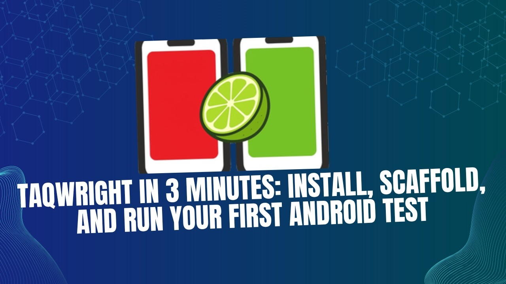
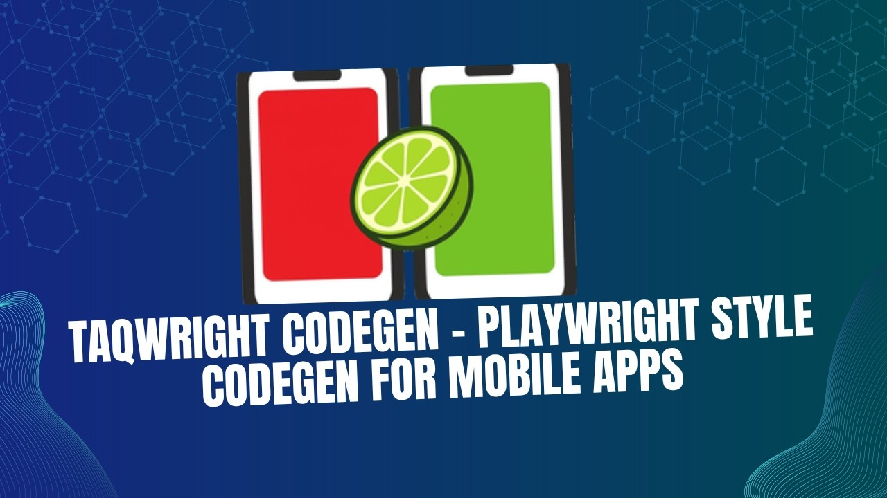

<!-- _class: lead -->

# 📱 taqwright
## A hands-on tutorial


**Playwright-style mobile test automation on Appium 3**
Deck · 12 labs · demo app included

<br>

<span class="small">Test the **Playwright way** on top of Appium 3 — walking the **entire taqwright docs**, top to bottom, with a runnable lab after each topic.</span>

---

<!-- _class: lead -->

# 👋 What's in this repo

---

## The repo at a glance

| | |
|---|---|
| 📊 [`slides.md`](slides.md) | this deck — the docs, top to bottom (`slides.html` / `slides.pdf` built alongside) |
| 🧪 **12 lab folders** | one runnable project per topic, each with its own `README.md` |
| 📱 [`app/`](app/) | the demo-app binaries under test — **committed**, nothing to download |
| 🖼️ [`images/`](images/) | diagrams used by the deck |

<span class="small">Clone it and go. Every lab is a self-contained TS project: `tests/*.spec.ts` + `taqwright.config.ts`.</span>

---

## The app under test

- 📦 [`taqelah/demo-app`](https://github.com/taqelah/demo-app/releases/tag/v1.0.0) **v1.0.0** — APK + `.app`, committed under [`app/`](app/)
- 🔑 Credentials: `emma@demoapp.com` / `10203040`
- 🤖 Appium **3.x** · UiAutomator2 (Android) · XCUITest (iOS, macOS only)

<span class="small">Every lab's `buildPath` already points at `app/` — no downloads, no per-lab setup. Install by hand if you like: `adb install -r app/DemoApp-v1.0.0.apk`</span>

---

## Why taqwright?

Raw Appium/WDIO is powerful but **boilerplate-heavy**: explicit waits, session setup, brittle selectors.

- 🎭 **Playwright's test runner** + a **flat `mobile` locator API**
- ⏳ **Auto-waiting** locators · 🔁 **auto-retrying** `expect()` — far less flake
- 📱 **iOS + Android** from the same test
- ⏺️ **Record** a flow · 🐛 **debug mode**

<span class="small">If you know Playwright for web, you already know 80% of this.</span>

---

## What it is

> **taqwright = the Playwright test runner with a flat `mobile` locator API on top of Appium 3.**

- `import { test, expect } from 'taqwright'`
- The **`mobile`** fixture: `getById`, `getByLabel`, `click`, `fill`, `expect(...).toBeVisible()`
- **TypeScript only** — `tests/*.spec.ts` + `taqwright.config.ts`

<span class="small">⚠️ **No `node/` + `python/` dual-stack.** One TS project per lab — that's the whole point.</span>

---

## Architecture — it overrides Playwright with Appium


<span class="small">**Keep** the Playwright runner · **swap** the backend: `mobile` → WebDriver → Appium 3.</span>

---

## Under the hood — reused vs swapped

| Layer | Playwright (web) | taqwright (mobile) |
|---|---|---|
| Runner · fixtures · reporters · `expect` | `@playwright/test` | **same** — reused as-is |
| Automation fixture | `page` | **`mobile`** |
| Protocol | CDP (Chrome DevTools) | **WebDriver** (`webdriver` pkg) |
| Backend | Chromium | **Appium 3** → UiAutomator2 / XCUITest |
| Escape hatch | `page` internals | **`mobile.raw`** (raw WebDriver) |

<span class="small">**Not a fork.** taqwright keeps the entire Playwright test experience and only swaps the bottom of the stack — so if you know Playwright, you already know taqwright. Built on `@playwright/test ^1.60` + `webdriver ^9.27`.</span>

---

## 🗺️ How this deck maps to the docs

The deck walks the **taqwright docs sidebar, top to bottom** — two groups:

<div class="cols">
<div>

**Part 1 · Getting started**
1. Installation
2. Codegen
3. Writing tests
4. Running & debugging

</div>
<div>

**Part 2 · Taqwright Test**
Actions · Assertions · Auto-waiting · Configuration · Annotations · Global setup & teardown · Parallelism · Parameterize · Projects · Reporters · Retries · Sharding · Timeouts · Trace viewer

</div>
</div>

---

## 🧪 The labs — hands-on after each topic (1 / 2)

| Lab | Exercises | After | Status |
|---|---|---|---|
| 🧰 [`tutorial_01_setup_lab/`](tutorial_01_setup_lab/) | install, provision & verify the toolchain | Installation | ✅ |
| 🎥 [`tutorial_02_codegen_lab/`](tutorial_02_codegen_lab/) | record a flow into a spec | Codegen | 🚧 scaffold |
| ⚙️ [`tutorial_03_config_lab/`](tutorial_03_config_lab/) | 6 mini-projects — one per config concept | Configuration | ✅ |
| 🏷️ [`tutorial_04_annotations_lab/`](tutorial_04_annotations_lab/) | tags · metadata · skip/fixme/fail/slow | Annotations | ✅ |
| 🌐 [`tutorial_05_global_setup_lab/`](tutorial_05_global_setup_lab/) | globalSetup/teardown module + setup project | Global setup | ✅ |
| ⚡ [`tutorial_06_parallel_lab/`](tutorial_06_parallel_lab/) | workers · device pool · autoDiscover | Parallelism | ✅ |

<span class="small">Each lab appears right after the topic it exercises — not bunched at the end. **Start with `tutorial_01_setup_lab`.** Every folder has its own `README.md` with the full walkthrough.</span>

---

## 🧪 The labs (2 / 2)

| Lab | Exercises | After | Status |
|---|---|---|---|
| 🔢 [`tutorial_07_parameterize_lab/`](tutorial_07_parameterize_lab/) | data-array loop · external JSON | Parameterize | ✅ |
| 🧩 [`tutorial_08_projects_lab/`](tutorial_08_projects_lab/) | android + iOS targets via `projects[]` | Projects | ✅ android |
| 🧬 [`tutorial_09_merge_report_lab/`](tutorial_09_merge_report_lab/) | blob reporter → `merge-reports` | Reporters | ✅ |
| 🔁⏱️🔎 [`tutorial_10_retry_timeout_trace_lab/`](tutorial_10_retry_timeout_trace_lab/) | flaky+retry · timeouts · trace | §17–19 | ✅ |
| 🧩 [`tutorial_11_page_object_lab/`](tutorial_11_page_object_lab/) | one spec, both platforms (base + subclasses) | Page Objects | ✅ |
| ☁️ [`tutorial_12_cloud_debug_lab/`](tutorial_12_cloud_debug_lab/) | page-object spec on BrowserStack | last topic | ✅ android |

<span class="small">`✅` = runnable on a local emulator/sim; cloud + iOS need creds / macOS.</span>

---

<!-- _class: lead -->

# Part 1 · Getting started 🚀

---

## 1 · Installation

```bash
node -v                         # ⚠️ must be v24+ — the ONE hard requirement
nvm install 24 && nvm use 24 && nvm alias default 24

npm init taqwright              # scaffold a new project (config, tsconfig, example spec)
# …or add taqwright to an existing project:
npm i -D @taqwright/taqwright@beta
```

<span class="small">`taqwright doctor` **errors** below Node 24; every other check is a soft warn. 📦 Package is **`@taqwright/taqwright`** — our labs alias it to `taqwright` so `import … from 'taqwright'` + `npx taqwright` both work.</span>

---

## 1 · Installation — watch (3 min)

<div class="cols">
<div>

[](https://www.youtube.com/watch?v=pk7wky1KHX8)

</div>
<div>

### ▶ Taqwright in 3 minutes
*install, scaffold, and run your first Android test*
<span class="small">TAQELAH Singapore</span>

<span class="small">Tap to watch the whole getting-started loop end to end — then we'll break down exactly what `init` asks and does.</span>

</div>
</div>

---

## 1 · `taqwright init` — the interactive flow

`npm init taqwright` asks a short series of questions (Enter accepts the `(default)`):

<div class="cols">
<div>

1. `Project location` *(./taqwright-tests)*
2. *(if not empty)* `continue and write into it?`
3. `Test folder name` *(tests)*
4. `Platform [android/ios/both]` *(ios/both = macOS only)*

</div>
<div>

5. **Android → probes your machine** → `Auto-install the Android toolchain? (~700 MB)`
6. `Also create an emulator? (~1 GB)` *(or pick an existing AVD)*
7. `Download the demo app?` · `Run npm install?`

</div>
</div>

<span class="small">**How you answer:** text = type or Enter · choice = type `android`/`ios`/`both` · confirm = `y`/`n` (capital = default) · AVD = a number. Bad input just re-asks.</span>

---

## 1 · `taqwright init` — a sample run

```text
taqwright init — scaffold a new project

Android toolchain:
  ✓ JDK (java v25.0.2)      ✓ Android SDK (adb)
  ✓ Appium 3.x (v3.3.1)     ✓ uiautomator2 driver
  ✓ Android emulator (AVD): Pixel_7_API_34
  → detected a working Android toolchain — skipping install.

Created:
  my-app/package.json   my-app/taqwright.config.ts
  my-app/tsconfig.json  my-app/tests/example.spec.ts
  my-app/.npmrc         my-app/.gitignore

Next steps:           Commands:
  cd my-app             npx taqwright doctor
  npx taqwright test    npx taqwright codegen · test · show-report
```

---

## 1 · `taqwright init` — outcomes, flags & CI

<div class="cols">
<div>

**Branches & outcomes**
- toolchain **detected → skips** install
- **fresh →** installs (~700 MB) ± **AVD** (~1 GB)
- demo app added **vs** no-op stub
- ⚠️ aborts: Node < 24 · **iOS on non-mac** · non-empty dir (no `--yes`)
- npm / toolchain fail → *scaffold still succeeds*, retry later

</div>
<div>

**Flags / non-interactive**
```bash
npx taqwright init my-app \
  --platform android \
  --test-dir tests \
  --no-demo-app --yes
```
<span class="small">All-flags or no-TTY → runs **scripted** with defaults (great for CI). Toggle prompts with `--[no-]install` · `--[no-]install-toolchain` · `--[no-]with-avd` · `--[no-]demo-app`.</span>

</div>
</div>

<span class="small">Then → **`doctor`** (ready?) · **`devices`** (targets?) · **`install`** (provision).</span>

---

## 1 · `taqwright doctor` — is my machine ready?

A **pre-flight check** of the whole mobile toolchain before you run a test.

```text
taqwright doctor (v0.1.0-beta.1)
  [ok] Node.js 24+                 — v24.15.0
  [ok] adb (Android SDK)           — on PATH
  [ok] ANDROID_HOME                — …/Library/Android/sdk
  [ok] java / JAVA_HOME (UiA2)     — v25.0.2
  [ok] Appium (test server)        — v3.3.1
  [ok] Appium drivers              — uiautomator2, xcuitest
  [ok] xcrun / Xcode (XCUITest)    — Xcode 26.5
```

<span class="small">**13 checks** across Android + iOS. **Node 24 is the only hard fail** — everything else is a soft **warn**, and you only need the rows for *your* platform. `--json` for CI / agents. Run it first whenever something's off.</span>

---

## 1 · `taqwright devices` — what can I target?

Lists every target taqwright can attach to — Android AVDs, iOS simulators, connected devices.

```text
Android (adb + emulator):        ← example output; YOUR AVD names differ
  Pixel 7 API 34       avd:Pixel_7_API_34   (shutdown)
  taqwright api34      avd:taqwright_api34  (shutdown)

iOS Simulators (xcrun simctl):
  iPhone 17 Pro        5BE0…1F9EA698        (shutdown, iOS 26.5)
  iPhone Air           FF95…A16985F         (booted,   iOS 26.5)
```

<span class="small">📋 Copy the **`avd:<id>`** into `device.name` (Android) or the **`<UDID>`** into `device.udid` (iOS) in `taqwright.config.ts`. **Never copy an AVD name off a slide or someone else's config — always take it from *your* `devices` output.** State = shutdown / booted — taqwright can cold-boot for you via `appium.autoStartDevice` or `device.autoDiscover`.</span>

---

## 1 · `taqwright install` — provision the toolchain

**Zero-touch setup on a fresh machine** — installs **JDK + Android SDK + Appium** (and the drivers).

```bash
npx taqwright install              # JDK + Android SDK + Appium — zero-touch
npx taqwright install --with-avd   # …also build a system image + emulator (~1 GB)
npx taqwright install --force      # reinstall even if already provisioned
npx taqwright install --print-env  # print export lines to use the toolchain from your shell
```

<span class="small">⚠️ **Android only** — iOS needs **Xcode** (manual). Sizes: ~700 MB toolchain, +~1 GB with the AVD.</span>

<span class="small">💡 **Prefer your own SDK.** `install` sets up a **separate, taqwright-managed** toolchain — handy for a *quick test* or a brand-new laptop, but it **won't see or drive an SDK / emulator you already have**. **Already set up? Skip `install`** and just point `device.name` at your existing AVD.</span>

---

## 🧪 Lab · `tutorial_01_setup_lab` ✅ get your machine ready

One-time **environment setup** before any taqwright test — end on a green smoke run.

```bash
cd tutorial_01_setup_lab     # the install & setup lab
nvm use 24                 # taqwright needs Node 24+ (the one hard requirement)
npm install                # installs taqwright

npx taqwright doctor                    # verify the toolchain — 13 checks, all green
npx taqwright test tests/smoke.spec.ts  # run the smoke spec — boots a device, reinstalls the app, asserts login
npx taqwright show-report               # open the HTML report
```

<span class="small">No setup beyond this: the config `autoDiscover`s + boots a device, auto-starts Appium, and reinstalls the shared `app/` APK each test. Green here = your machine's ready for every lab in this repo. → [`tutorial_01_setup_lab/`](tutorial_01_setup_lab/)</span>

---

<!-- _class: lead -->

# 🎥 2 · Codegen
## Playwright-style codegen for mobile

<span class="small">Record a flow on a live device → a clean taqwright spec. Deep dive into the inspector.</span>

---

## 🎬 See it in action

<div class="cols">
<div>

[](https://www.youtube.com/watch?v=FBxFg1XbuKE)

</div>
<div>

### ▶ Taqwright Codegen
*Playwright-style codegen for mobile*
<span class="small">TAQELAH Singapore</span>

<span class="small">Tap to watch: connect a device, drive the app, and watch a runnable spec build itself — locators ranked live.</span>

<span class="small">🔗 youtube.com/watch?v=FBxFg1XbuKE</span>

</div>
</div>

---

## 2 · Codegen — launch & connect

```bash
npx taqwright codegen
```

- Opens a **web inspector at `localhost:4280`** (auto-picks a free port) in your browser
- Reads `taqwright.config.ts` — project, caps (UiAutomator2, `noReset`), Appium host/port
- Connect to a **local** emulator/device *(Appium auto-starts)* **or a cloud** device (BrowserStack / LambdaTest)
- **Boot / stop** emulators & simulators right from the UI · Ctrl+C cleans the session up

---

## 2 · Codegen — on a cloud device ☁️

**No local emulator?** Point the inspector at a **real device on BrowserStack** (or LambdaTest) and still get the **live screen + inspect + record**.

```bash
export BROWSERSTACK_USERNAME=...     # inspector pre-fills these
export BROWSERSTACK_ACCESS_KEY=...
npx taqwright codegen
```

- ① creds from env (or type them) → ② pick a **device + OS** from the listed cloud devices → ③ point at your uploaded app (**`bs://…`**)
- Same **live screen mirror**, same **ranked + uniqueness-checked** locators, same **recording → spec**
- Real **permission dialogs** show up (auto-grant is off during codegen) — so you can record them

<span class="small">Generate on a cloud device, then run the spec on the same grid → [`tutorial_12_cloud_debug_lab/`](tutorial_12_cloud_debug_lab/).</span>

---

## 2 · Codegen — the inspector UI

Four things on one screen:

- 📱 **Live screen mirror** — tap / type / swipe the real device in your browser
- 🌳 **View tree** — the live accessibility tree (never guess from a screenshot)
- 🎯 **Locators tab** — every viable locator, **ranked + uniqueness-checked** against the screen
- 📝 **Recorded script tab** — ready-to-paste taqwright code, filling in as you act

<span class="small">Native ↔ webview? The inspector lists contexts and **switches** between them.</span>

---

## 2 · Codegen — the locator suggester

For the selected element it generates candidates **per category**, **verifies each against the live screen** (how many match · is it unique), then **recommends** the best.

<div class="cols">
<div>

**Priority order** *(from source)*
**Android:** `getById` → `getByUiSelector` → `getByXpath`
**iOS:** `getById` → `getByPredicate` → `getByClassChain` → `getByXpath`
**Web view:** `getByCss` → `getByXpath`

</div>
<div>

**Smarts**
- ✅ prefers **unique** + stable (id) over positional
- 🔢 not unique? falls back to **`.nth(i)`**
- ⚠️ flags **positional** locators as fragile

</div>
</div>

<span class="small">Same ranking as `taqwright inspect` — codegen just also records what you do with it.</span>

---

## 2 · Codegen — what it records · actions

Every gesture and action becomes a typed step (then `toSpec()` → code):

<div class="cols">
<div>

**Gesture / screen**
`tap` · `swipe` · `screenScroll`

**Touch**
`click` · `doubleTap` · `longPress` · `press` · `focus` · `blur`

</div>
<div>

**Input & controls**
`fill` · `clear` · `pressSequentially` · `check` / `uncheck` · `selectOption` (label / index / date / time)

**Movement**
`swipe` · `scrollIntoView` · `pinch` (in/out) · `dragTo`(target)

</div>
</div>

<span class="small">Plus `sendKeys` (device keyboard), `switchContext` (native↔webview), and freeform `comment` lines.</span>

---

## 2 · Codegen — what it records · assertions

Click "assert" on an element → an **auto-retrying `expect(...)`** is recorded:

<div class="cols">
<div>

**State**
`toBeVisible` / `toBeHidden`
`toBeEnabled` / `toBeDisabled`
`toBeChecked` / unchecked
`toBeEditable` / readonly
`toBeFocused` · `toBeAttached`
`toBeEmpty` · `toBeInViewport`

</div>
<div>

**Value**
`toHaveText` (exact | contains)
`toHaveValue`
`toHaveCount`
`toHaveAttribute`

</div>
</div>

<span class="small">Recorded assertions are real auto-retrying matchers — not one-shot `isVisible()` reads.</span>

---

## 2 · Codegen — output & export

`Recorder.toSpec()` writes a runnable **taqwright TypeScript** spec — but it's not the only target:

<div class="cols">
<div>

```ts
// recorded.spec.ts (taqwright)
test('flow', async ({ mobile }) => {
  await mobile.getById('Login').click();
  await expect(mobile.getByText('Welcome'))
    .toBeVisible();
});
```

</div>
<div>

**Also exports the same recording as:**
- 🐍 **Python** Appium steps (`toStepsPython`)
- ☕ **Java** Appium steps (`toStepsJava`)

</div>
</div>

<span class="small">Then **clean it up**: swap any positional/xpath locators for the recommended stable one, keep the assertions. Codegen is a *starting point*, not the finished test.</span>

---

## 🧪 Lab · `tutorial_02_codegen_lab` 🎥 record a flow 🚧

Stop hand-writing locators — **record** them: the inspector ranks candidates by **stability + uniqueness** and emits paste-ready taqwright code.

**This lab ships with no spec — `tests/` is empty. Record the *add to cart* flow on the demo app, save it into `tests/`, then run it.**

```bash
cd tutorial_02_codegen_lab    # the codegen / record lab — no spec ships with it
npm install                 # installs taqwright

npx taqwright codegen       # record on the demo app: log in → Shop All → search "black dress" → add to cart
mkdir -p tests              # paste the Recorded script into tests/search-add-to-cart.spec.ts
npx taqwright test tests/search-add-to-cart.spec.ts   # run the spec you just recorded
npx taqwright show-report   # open the HTML report
```

<span class="small">**Clean it up:** swap positional/xpath for the recommended stable locator, keep the assertions. Captures actions · gestures · **assertions** (→ retrying `expect()`); can export **Python / Java** too. 🎥 Watch the codegen video first.</span>

---

## 3 · Writing tests

```ts
import { test, expect } from 'taqwright';   // docs: '@taqwright/taqwright'

test('a valid user can log in', async ({ mobile }) => {
  // login fields are Flutter EditTexts with no label → match the hint
  await mobile.getByXpath("//*[@hint='Username']").fill('emma@demoapp.com');
  await mobile.getByXpath("//*[@hint='Password']").fill('10203040');
  await mobile.getByLabel('Login').click();            // button has an accessibility id
  await expect(mobile.getByLabel('View All')).toBeVisible();
});
```

- Each test gets a **fresh Appium session**, torn down automatically
- Locators are **lazy** — nothing runs until an action or assertion
- Actions **auto-wait** for visible + enabled — **no sleeps**

---

## 3 · Writing tests — locator getters

| Getter | Resolves to | Stability |
|---|---|---|
| `getById` / `getByTestId` | resource-id / accessibility id | ⭐⭐⭐ best |
| `getByLabel` | accessibility label / content-desc | ⭐⭐⭐ |
| `getByRole('button', { name })` | widget-type mapping | ⭐⭐ |
| `getByText(/…/i)` | visible text | ⭐ fragile (i18n) |
| `getByType('android.widget.…')` | class / XCUI type | last resort |
| `getByXpath` | raw XPath | 🐢 slowest |

<span class="small">Demo-app login fields are Flutter `EditText`s with no id → `getByType('android.widget.EditText').nth(0|1)`. Button & home marker have ids → `getByLabel`.</span>

---

## 3 · Writing tests — fresh state

```ts
// Option A — relaunch in a hook (no buildPath needed)
test.beforeEach(async ({ mobile }) => {
  await mobile.terminateApp().catch(() => {});
  await mobile.launchApp();
});
```

```ts
// Option B — reinstall before every test (config)
resetBetweenTests: true,
buildPath: './DemoApp-v1.0.0.apk',
appBundleId: 'com.taqelah.demo_app',
```

<span class="small">Default: sessions persist across tests in a worker. Keep `beforeEach` **light** — it runs every test.</span>

---

## 4 · Running & debugging

```bash
npx taqwright test                    # all projects (Appium auto-starts)
npx taqwright test login.spec.ts      # one file
npx taqwright test --grep "log in"    # by title / tag
npx taqwright test --project android  # one project
npx taqwright show-report             # open the HTML report
```

- 📸 **trace** · 🎥 **video** · 🌐 **network** — each `off` / `on` / `on-failure`
- Artifacts land in `test-results/` (default `outputDir`); taqwright prints the exact `show-report` command at the end
- 🐞 `await mobile.pause()` hands the running session to the inspector

---

<!-- _class: lead -->

# Part 2 · Taqwright Test ⚙️

---

## 6 · Actions — on a locator

```ts
await mobile.getByXpath("//*[@hint='Username']").fill('emma@demoapp.com');
await mobile.getByLabel('darkMode').check();
await mobile.getByType('android.widget.Spinner').selectOption('Large');
```

- **Text:** `fill` · `clear` · `pressSequentially`
- **Controls:** `check` · `uncheck` · `selectOption` (picker / spinner / date-time)
- **Touch:** `click`/`tap` · `doubleClick` · `longPress` · `press` · `focus` · `blur`
- **Gestures:** `swipeLeft/Right/Up/Down` · `dragTo` · `pinchIn`/`pinchOut` · `scrollIntoView`

<span class="small">Every action **auto-waits** for visible + enabled first. No web-only file-upload / hover on mobile.</span>

---

## 6 · Actions — screen & lifecycle

```ts
await mobile.swipe('up');                 // whole-screen
await mobile.scrollIntoView(locator);
await mobile.pressButton('BACK');         // BACK · HOME · POWER · VOLUME_*
await mobile.launchApp();                 // app lifecycle
await mobile.terminateApp();
```

- **Screen:** `swipe` · `scroll` · `scrollIntoView` · `pressButton` · `goBack` · `screenshot`
- **Lifecycle:** `launchApp` · `terminateApp` · `activateApp` · `installApp` · `openDeepLink`
- **OS:** `setOrientation` · `hideKeyboard` · `acceptAlert` / `dismissAlert` · `setLocation` · clipboard · permissions

<span class="small">Escape hatch: `mobile.get raw` → the underlying WebDriver.</span>

---

## 7 · Assertions — auto-retrying `expect()`

```ts
await expect(mobile.getByLabel('Submit')).toBeEnabled();
await expect(mobile.getByText(/welcome/i)).toBeVisible({ timeout: 10_000 });
await expect(mobile.getByText('Error')).not.toBeVisible();
```

State: `toBeVisible` · `toBeHidden` · `toBeEnabled` · `toBeDisabled` · `toBeChecked` · `toBeEditable` · `toBeFocused` · `toBeAttached` · `toBeInViewport` · `toBeEmpty`
Value: `toHaveText` · `toContainText` · `toHaveValue` · `toHaveCount` · `toHaveAttribute`

<span class="small">Auto-retries up to 30 s. Two styles: `expect(locator).toBe…` **or** `locator.assert…()`.</span>

---

## 7 · Assertions — beyond the basics

```ts
expect.soft(mobile.getByText('A')).toBeVisible();   // record, don't stop
await expect(mobile.getByText('B')).toBeVisible();   // run keeps going

await expect.poll(() => api.status()).toBe('ready'); // poll a value
await expect(async () => { /* … */ }).toPass();      // retry a block
```

- `.not` works on **state** matchers (value matchers reject it — clear error)
- Plain values (`expect(2+2).toBe(4)`) fall through to **non-retrying** native assertions
- Second arg = a **custom message** shown in the report

<span class="small">⚠️ Web-only Playwright matchers (`toHaveCSS`, `toHaveClass`…) **throw**.</span>

---

## Appium-by-hand vs taqwright

<div class="cols">
<div>

**Raw Appium — WebdriverIO**
```js
const u = await $('android=new ' +
  'UiSelector().className(' +
  '"android.widget.EditText")' +
  '.instance(0)')
await u.waitForDisplayed({ timeout: 20000 })
await u.setValue('emma@demoapp.com')
// …password, click…
expect(await $('~View All')
  .isDisplayed()).toBe(true)
```

</div>
<div>

**taqwright**
```ts
await mobile.getByType(
  'android.widget.EditText')
  .nth(0).fill('emma@demoapp.com')
// …password, click…
await expect(
  mobile.getByLabel('View All'))
  .toBeVisible()
```

</div>
</div>

<span class="small">Same flow, same driver underneath — **fewer lines, auto-waits built in, one language**.</span>

---

## 8 · Auto-waiting

> Before driving an element, taqwright runs **actionability checks** and retries them, polling every **200 ms** up to the timeout (30 s).

<div class="cols">
<div>

**Actions** wait for
✅ visible **+** enabled
`click` · `fill` · `check` · `swipe` · `drag`

</div>
<div>

**Queries** wait for
✅ visible only
`getText` · `getValue` · `boundingBox` · `screenshot`

</div>
</div>

<span class="small">So tapping a button still animating in, or filling a field not yet rendered, **just works** — no sleeps. Need a custom wait? `locator.waitFor({ state: 'hidden' | 'attached' | 'disabled' })`.</span>

---

## 8 · Auto-waiting — the trap to avoid

<div class="cols">
<div>

❌ **One-shot, racy**
```ts
await mobile.waitForTimeout(2000);
if (await loc.isVisible()) {
  // checks ONCE, right now
}
```

</div>
<div>

✅ **Auto-retrying**
```ts
await expect(loc).toBeVisible();
// polls until visible
// or times out
```

</div>
</div>

<span class="small">`isVisible()` is a boolean at **one instant**; `expect(...).toBeVisible()` **waits**. Hardcoded sleeps are the #1 cause of flake — and unnecessary here.</span>

---

## 9 · Configuration — what & where

```ts
import { defineConfig, Platform } from 'taqwright';

export default defineConfig({
  testDir: './tests',
  timeout: 60_000,
  expectTimeout: 30_000,
  reporter: [['list'], ['html', { open: 'never' }]],
  projects: [ /* one per device target — each has its own `use` */ ],
});
```

<span class="small">One file (`taqwright.config.ts`), generated by `init`. **Top-level keys = the whole run**; **`projects[]` = where/how each device target runs** — and a project key **overrides** the top-level one.</span>

<span class="small">🧪 Each concept below has a hands-on **mini-project** in [`tutorial_03_config_lab/`](tutorial_03_config_lab/) — try it right after the slide.</span>

---

## 9 · Configuration — top-level · tests & timing

| Key | Type | Default | What it does |
|---|---|---|---|
| `testDir` | `string` | `.` | Root folder taqwright scans for specs |
| `testMatch` | `string \| RegExp \| []` | `**/*.spec.ts` | Which files **are** tests |
| `testIgnore` | `string \| RegExp \| []` | — | Files to skip |
| `timeout` | `number` (ms) | `30_000` | **Per-test** budget (hooks included) |
| `expectTimeout` | `number` (ms) | `5_000` | Bounds **assertions + actions**; polls every 200 ms |
| `retries` | `number` | `0` | Re-run a failed test from scratch *(deep dive: §17)* |

<span class="small">All of these are **overridable per project** and via CLI flags (`--timeout`, `--retries`, …).</span>

---

## 🧪 Lab · `tutorial_03_config_lab/1_tests_and_timing/` ⏱️

```bash
cd tutorial_03_config_lab/1_tests_and_timing
npm install && npm test
```

<span class="small">Spotlights `testDir` · `timeout` · `expectTimeout` · `retries`. Try: drop `timeout` to `5_000`; break a locator with `retries: 1` → watch the rerun + **flaky** flag. → [`1_tests_and_timing/`](tutorial_03_config_lab/1_tests_and_timing/)</span>

---

## 9 · Configuration — top-level · execution & output

| Key | Type | Default | What it does |
|---|---|---|---|
| `workers` | `number` | `1` | Parallel device workers *(§12)* |
| `fullyParallel` | `boolean` | `false` | Split tests **within** a file across workers |
| `reporter` | `name \| [name, opts][]` | `'list'` | `list·line·dot·html·json·junit·blob·github` *(§15)* |
| `outputDir` | `string` | `test-results` | Where traces / videos / artifacts land |
| `globalSetup` | `string \| string[]` | — | Module run **once** before all tests *(§11)* |
| `globalTeardown` | `string \| string[]` | — | Module run **once** after all tests |
| `forbidOnly` | `boolean` | `false` | Fail the run if a stray `test.only` is committed (CI) |

---

## 🧪 Lab · `tutorial_03_config_lab/2_execution_and_output/` ⚡

```bash
cd tutorial_03_config_lab/2_execution_and_output
npm install && npm test
```

<span class="small">Spotlights `workers` · `reporter` · `globalSetup` · `forbidOnly`. Watch the `[global-setup]` log, `report.json`, and `./artifacts`. Try: `workers: 2`; add `test.only` → `forbidOnly` fails the run. → [`2_execution_and_output/`](tutorial_03_config_lab/2_execution_and_output/)</span>

---

## 9 · Configuration — the `use` block · app & session

Each project's `use` describes **one device target + how the app is handled**:

| Key | Type | Notes |
|---|---|---|
| `platform` | `Platform.ANDROID \| .IOS` | **required** |
| `device` | `DeviceConfig` | **required** — see *device providers* → |
| `appBundleId` | `string` | App package id (`com.taqelah.demo_app`) |
| `buildPath` | `string` | Path to `.apk` / `.app` (rel. to config) |
| `resetBetweenTests` | `boolean` | Reinstall + relaunch before **every** test |
| `capabilities` | `Record<string, unknown>` | Extra raw Appium caps, merged in |
| `expectTimeout` | `number` (ms) | Per-project override |

<span class="small">⚠️ **Type rule:** `resetBetweenTests: true` *requires* **both** `buildPath` **and** `appBundleId` (TS-enforced union). Omit / `false` → app is left as-is between tests.</span>

---

## 🧪 Lab · `tutorial_03_config_lab/3_use_app_and_session/` 📦

```bash
cd tutorial_03_config_lab/3_use_app_and_session
npm install && npm test
```

<span class="small">Spotlights `platform` · `buildPath` · `resetBetweenTests` · `capabilities`. Try: the **reset trio** — `resetBetweenTests: true` + `buildPath` + `appBundleId` — is type-required *together*; comment out any one and **TypeScript errors** (put it back, error clears). → [`3_use_app_and_session/`](tutorial_03_config_lab/3_use_app_and_session/)</span>

---

## 9 · Configuration — `use` artifacts · trace · video · network

```ts
use: { trace: 'on-failure', video: 'on-failure', network: 'off' }
```

| Key | Captures | |
|---|---|---|
| `trace` | per-action **screenshots + page source** timeline | *(viewer → §19)* |
| `video` | screen recording (`.mp4`) | |
| `network` | HTTP traffic (HAR) | 🚧 *upcoming / WIP* |

<span class="small">All share the same modes: **`'off'`** (default) · **`'on'`** · **`'on-failure'`** · **`'retain-on-failure'`** (keep on fail, discard on pass). `'on'` is heavy — prefer **`'on-failure'`** in CI. `network` is **🚧 work in progress** — `trace` + `video` are live today.</span>

---

## 🧪 Lab · `tutorial_03_config_lab/4_artifacts/` 🔎

```bash
cd tutorial_03_config_lab/4_artifacts
npm install && npm test && npx taqwright show-report
```

<span class="small">Spotlights `trace` · `video` · `network` (modes `off` · `on` · `on-failure` · `retain-on-failure`). `trace:'on'` here → step through **every** action in the report. → [`4_artifacts/`](tutorial_03_config_lab/4_artifacts/)</span>

---

## 9 · Configuration — `device` providers

<div class="cols">
<div>

**Local — `emulator` / `local-device`**
```ts
device: {
  provider: 'emulator',
  name: 'Pixel_7_API_34', // ← EXAMPLE — use yours
  udid: 'emulator-5554',  // wins over name
  osVersion: '14',
  orientation: 'portrait',// | 'landscape'
  autoDiscover: true,     // default: enumerate+boot
  // pool: [{ udid, name?, osVersion? }] // workers>1
}
```

</div>
<div>

**Cloud — `browserstack` / `lambdatest`**
```ts
device: {
  provider: 'browserstack',
  name: 'Google Pixel 8',  // required
  osVersion: '14.0',       // required
  orientation: 'portrait',
  enableCameraImageInjection: false,
}
```

</div>
</div>

<span class="small">Four `provider`s. Local defaults to `autoDiscover: true` (no fixed `name` needed); cloud **requires** `name` + `osVersion`. Cloud creds come from env (`BROWSERSTACK_USERNAME` / `…_ACCESS_KEY`) → §14.</span>

---

## 9 · Configuration — device · how to target

<div class="cols">
<div>

**1 · `udid` — pin one exact device**
```ts
device: { provider: 'emulator',
          udid: 'emulator-5554' } // wins over name
```
<span class="small">Copy it from `npx taqwright devices` / `adb devices`. Use when several devices are attached.</span>

**2 · `autoDiscover` — let taqwright pick** *(default)*
```ts
device: { provider: 'emulator', autoDiscover: true }
```
<span class="small">No name/udid needed — enumerates + boots what's available; finds several when `workers > 1`. What `tutorial_01_setup_lab` uses.</span>

</div>
<div>

**3 · `pool` — explicit devices for workers**
```ts
workers: 2,
device: { provider: 'emulator', pool: [
  { udid: 'emulator-5554' },  // ← YOUR serials
  { udid: 'emulator-5556' },  //   (npx taqwright devices)
] }
```
<span class="small">Each worker grabs one entry `{ udid, name?, osVersion? }`. Overrides auto-discovery. ⚠️ Pool entries are **machine-specific** — AVD ids/serials differ on every laptop; always paste your own.</span>

**4 · Cloud — BrowserStack / LambdaTest**
```ts
device: { provider: 'browserstack',
          name: 'Google Pixel 8', osVersion: '14.0' }
```
<span class="small">`name`+`osVersion` required · creds via env · `buildPath` uploaded. Run `--project browserstack`.</span>

</div>
</div>

<span class="small">Precedence: **`udid` › `pool` › `name` › `autoDiscover`**. `appium.autoStartDevice: true` cold-boots a chosen device that's offline.</span>

---

## 🧪 Lab · `tutorial_03_config_lab/5_device_providers/` 📱

```bash
cd tutorial_03_config_lab/5_device_providers
npm install && npm test
```

<span class="small">Spotlights `emulator` · `udid` · `pool` · cloud. Try: swap `autoDiscover` for `udid: 'emulator-5554'`; uncomment the `browserstack` project + creds. Precedence: `udid › pool › name › autoDiscover`. → [`5_device_providers/`](tutorial_03_config_lab/5_device_providers/)</span>

---

## 9 · Configuration — the `appium` server

```ts
use: { appium: { autoStart: true, host: 'localhost', port: 4723, path: '/' } }
```

| Key | Default | What it does |
|---|---|---|
| `autoStart` | `true` | Spawn Appium on `host:port` if nothing's listening |
| `autoStartDevice` | `false` | Cold-boot an offline emulator (needs string `name`) |
| `host` · `port` · `path` | `localhost` · `4723` · `/` | Where to reach Appium |
| `newCommandTimeout` | `60` (s) | Idle time before Appium kills the session |
| `connectionTimeout` | `5000` (ms) | Wait for the server to respond |
| `logLevel` | — | `trace·debug·info·warn·error·silent` |

<span class="small">📂 Live, runnable examples of **all** of the above: [`tutorial_01_setup_lab/`](tutorial_01_setup_lab/) & the [`tutorial_03_config_lab/`](tutorial_03_config_lab/) projects' `taqwright.config.ts`.</span>

---

## 🧪 Lab · `tutorial_03_config_lab/6_appium_server/` 🔌

```bash
cd tutorial_03_config_lab/6_appium_server
npm install && npm test
```

<span class="small">Spotlights `autoStart` · `autoStartDevice` · `host`/`port`/`path` · timeouts · `logLevel`. Try: `logLevel: 'debug'` to see the Appium handshake; start `appium` yourself → it attaches instead. → [`6_appium_server/`](tutorial_03_config_lab/6_appium_server/)</span>

---

## 10 · Annotations — control execution

```ts
test.skip('apple pay', async ({ mobile }) => { /* … */ });   // never runs
test.skip(isCI, 'flaky on CI');                              // conditional
test.fixme('known broken', async ({ mobile }) => { /* … */ }); // won't run/fail
test.fail('reproduces TAQ-9', async ({ mobile }) => { /* … */ }); // passes IF it fails
test('huge flow', async ({ mobile }) => { test.slow(); /* 3× timeout */ });
```

<span class="small">All take the conditional `(condition, reason)` form — platform-specific logic in one test, no duplication. `test.only` focuses a single test while developing.</span>

---

## 10 · Annotations — tags & metadata

```ts
test('checkout', { tag: '@smoke' }, async ({ mobile }) => { /* … */ });
test('payments', { tag: ['@smoke', '@payments'] }, async ({ mobile }) => { /* … */ });
```

```bash
npx taqwright test --grep @smoke            # run only smoke
npx taqwright test --grep-invert @payments  # everything except payments
```

```ts
// freeform metadata → surfaces in the report
test('issue repro', { annotation: { type: 'issue', description: 'TAQ-482' } }, …);
```

<span class="small">Runtime: push to `test.info().annotations` when a condition emerges mid-run.</span>

---

## 🧪 Lab · `tutorial_04_annotations_lab/` 🏷️

```bash
cd tutorial_04_annotations_lab
npm install
npx taqwright test --list          # see how each test is reported
npx taqwright test --grep @smoke   # run only @smoke-tagged tests
npm test                           # all: skip/fixme excluded · fail expected · slow tripled
```

<span class="small">Demos `tag` · `annotation` metadata · `test.skip`/`fixme`/`fail`/`slow`. Try: `--grep-invert @checkout`; `CI=1 npx taqwright test` flips the conditional `test.skip(isCI, …)`. → [`tutorial_04_annotations_lab/`](tutorial_04_annotations_lab/)</span>

---

## 11 · Global setup & teardown

<div class="cols">
<div>

**Setup project** (needs a device)
```ts
// config
projects: [
  { name: 'setup',
    testMatch: /global\.setup\.ts/ },
  { name: 'android',
    dependencies: ['setup'],
    use: { /* … */ } },
]
```
```ts
import { test as setup } from 'taqwright';
setup('sign in once', async ({ mobile }) => { /* … */ });
```

</div>
<div>

**globalSetup module** (no device)
```ts
// config
globalSetup: './global-setup.ts',
globalTeardown: './global-teardown.ts',
```
```ts
export default async () => {
  const r = await fetch(SEED_URL);
  process.env.SEED = await r.text();
};
```
API calls / seeding / file work only.

</div>
</div>

<span class="small">**Use `globalSetup`/`globalTeardown` for** one-time, **device-free** prep shared by all tests (seed a DB · mint a token · start a mock server), undone once at the end. *Per-test* → `beforeEach`; *device* setup (sign in) → a **setup project**.</span>

---

## 11 · Setup scopes — global setup vs spec hooks

| Mechanism | Scope | Device? | Use for |
|---|---|---|---|
| `globalSetup` / `globalTeardown` | once per **run** | ❌ | seed/reset a DB · mint a token · start a mock server |
| **setup project** (`dependencies`) | once, **before dependents** | ✅ | sign in once · grant permissions |
| `beforeAll` / `afterAll` | once per **file** (or `describe`) | ✅ | per-file prep — open a screen once |
| `beforeEach` / `afterEach` | **every test** | ✅ | reset state · navigate to a start point |

```text
globalSetup → setup project → ┃ beforeAll → (beforeEach → TEST → afterEach)* → afterAll ┃ → globalTeardown
```

<span class="small">`globalSetup`/`globalTeardown` = config-level, **no device**, once for the whole run. `beforeAll`/`beforeEach` = in-worker, **have the `mobile` device fixture**. (These labs get per-test fresh state from `resetBetweenTests` instead of a `beforeEach`.)</span>

---

## 🧪 Lab · `tutorial_05_global_setup_lab/` 🌐

```bash
cd tutorial_05_global_setup_lab
npm install
npm test     # watch the order: [globalSetup] → setup project → android tests → [globalTeardown]
```

<span class="small">Demos **every scope**: `globalSetup`/`globalTeardown` module · **setup project** (`dependencies`) · `beforeAll`/`afterAll` · `beforeEach`/`afterEach` (in `hooks.spec.ts`). Run `npm test` and read the order in the console. → [`tutorial_05_global_setup_lab/`](tutorial_05_global_setup_lab/)</span>

---

## 12 · Parallelism

taqwright runs **serially by default** (`workers: 1`). Scale out across **devices**:

```ts
workers: 3,
use: {
  device: { provider: 'emulator', autoDiscover: true },   // or pool: [avd1, avd2, avd3]
}
```

- Each worker grabs a device and spawns its **own Appium** on a staggered port
- `workers > 1` needs an adequate `pool` **or** `autoDiscover: true` (else it fails at load)
- `fullyParallel` changes scheduling granularity (tests-in-a-file vs whole files) — it **never** raises the device count
- ⚠️ A `pool` hardcodes **AVD ids + serials that only exist on the machine that wrote it** — swap in your own from `npx taqwright devices`, or use `autoDiscover` and stay portable

<span class="small">🔁 Two emulators, one command — the device fan-out is **declarative**, not wiring you hand-roll.</span>

---

## 🧪 Lab · `tutorial_06_parallel_lab/` ⚡

```bash
cd tutorial_06_parallel_lab
npm install
npx taqwright test --project android-auto-1    # autoDiscover · serial (1 device)
npx taqwright test --project android-auto-2    # autoDiscover · 2-wide (needs 2 AVDs)
npx taqwright test --project android-single     # ⚠️ edit the AVD name/udid first
npx taqwright test --project android-pool-2     # ⚠️ edit the 2 pool entries first
```

**⚠️ `android-single` + `android-pool-2` are pinned to *my* emulators** (`Pixel_10_Pro_XL`, `emulator-5554`, …) — **yours are named differently.** Run `npx taqwright devices` and paste your own `avd:<id>` + serial into `taqwright.config.ts`. The two **`auto`** projects need no edits and run anywhere.

<span class="small">4 projects, one per strategy: pinned `udid` · `pool` of 2 · `autoDiscover` (1- & 2-wide). Worker *i* gets its own device + Appium on `4723+i`. Adapted from the [taqwright-demo](https://github.com/Taqwright/taqwright-demo) config. → [`tutorial_06_parallel_lab/`](tutorial_06_parallel_lab/)</span>

---

## 13 · Parameterize tests

```ts
const accounts = [
  { label: 'standard', username: 'emma@demoapp.com', password: '10203040' },
  { label: 'admin',    username: 'admin@demoapp.com', password: 'admin123' },
];

for (const a of accounts) {
  test(`login as ${a.label}`, async ({ mobile }) => {
    await mobile.getByXpath("//*[@hint='Username']").fill(a.username);
    // …
  });
}
```

<span class="small">Also: **option fixtures** (`test.extend` + `test.use`), **project-based** (same specs × devices), and **external CSV/JSON** loaded at collection time. 🔁 Classic **data-driven** testing, the taqwright way.</span>

---

## 🧪 Lab · `tutorial_07_parameterize_lab/` 🔢

```bash
cd tutorial_07_parameterize_lab
npm install
npx taqwright test --list      # one test per data row
npx taqwright test tests/parameterize.spec.ts
```

<span class="small">Loop a data array → one `test()` per row (valid · wrong password · unknown user). Same flow driven from an external **JSON** file in `from-json.spec.ts`. Slide also mentions option fixtures (`test.extend`) + project-based. → [`tutorial_07_parameterize_lab/`](tutorial_07_parameterize_lab/)</span>

---

## 14 · Projects

> A **project** = a named group of tests with one `use`: a platform, a device, a build, and its artifacts.

```ts
projects: [
  { name: 'android', use: { platform: Platform.ANDROID, device: {/*…*/} } },
  { name: 'ios',     use: { platform: Platform.IOS,     device: {/*…*/} } },
]
```

```bash
npx taqwright test --project android --project ios   # repeatable
```

<span class="small">Fields: `name` · `use` · `dependencies` · `testMatch` · `testIgnore`. Dependencies run first; if one fails, its dependents **skip**. Same specs → Android, iOS, BrowserStack.</span>

---

## 🧪 Lab · `tutorial_08_projects_lab/` 🧩

```bash
cd tutorial_08_projects_lab
npm install
npx taqwright test --project android   # Android login
npx taqwright test --project ios       # iOS login (macOS + simulator)
npx taqwright test                     # both targets
```

<span class="small">Two `projects[]` — an **`android`** and an **`ios`** target, each with its own `use` (platform · device · build · bundle id) running its own `login.spec.ts`. Same idea scales to BrowserStack. → [`tutorial_08_projects_lab/`](tutorial_08_projects_lab/)</span>

---

## 15 · Reporters

```ts
reporter: [
  ['list'],                                   // one line per test (default)
  ['html', { open: 'never' }],                // browsable folder
  ['json', { outputFile: 'reports/out.json' }],
]
```

| Reporter | Use |
|---|---|
| `list` · `line` · `dot` | console — verbose → compact → one char/test |
| `html` | self-contained browsable report |
| `json` · `junit` | custom tooling · CI ingest |
| `blob` · `github` | shardable archive · GH Actions annotations |

<span class="small">`npx taqwright merge-reports reports/blob --reporter html` combines sharded runs.</span>

---

## 16 · Sharding

Split one suite across **machines** for CI speed:

```bash
npx taqwright test --shard 1/4 --reporter blob   # machine 1 of 4
# …machines 2–4 → 2/4, 3/4, 4/4
npx taqwright merge-reports ./all-blobs --reporter html
```

- **How tests are assigned:** taqwright sorts every test **deterministically**, then splits into `N` even-by-**count** slices — machine `i` runs slice `i`. Automatic & repeatable; you **can't pin** a test to a machine.
- **Unit:** whole **files** by default; `fullyParallel: true` → individual **tests** (finer balance)
- ⚠️ Balances by **count, not duration** (one slow test = a long-pole shard) · each shard needs its **own device**
- GitHub Actions: a **matrix** of 4 jobs upload blobs → a merge job builds one HTML report

---

## `tutorial_09_merge_report_lab` — how shard + merge fit 🧬

The lab runs **both shards on ONE machine, back-to-back** — a local stand-in for CI's many machines.

```text
ONE machine · two slices run sequentially:
  shard 1/2  --reporter blob → report-1.zip ┐
  shard 2/2  --reporter blob → report-2.zip ┴→ all-blobs/ → merge-reports → 1 HTML report
```

- **`--shard i/N`** runs a *slice* of the suite (file-level); **`--reporter blob`** emits one archive per slice
- 🪤 **because it's one machine**, the blob reporter **clears `blob-report/` between the two runs** → each shard **moves** its blob into `all-blobs/` first (otherwise shard 2 overwrites shard 1)
- **In real CI** it's **N separate machines**: each runs one shard + uploads its blob → a merge job downloads them all → `merge-reports all-blobs --reporter html` → one report

---

## 🧪 Lab · `tutorial_09_merge_report_lab/` 🧬

```bash
cd tutorial_09_merge_report_lab
npm install
npm run shard1     # --shard 1/2 --reporter blob → all-blobs/
npm run shard2     # --shard 2/2 --reporter blob → all-blobs/
npm run merge      # merge-reports all-blobs --reporter html
npm run report     # one combined HTML report
```

<span class="small">Each shard emits a **`blob`** archive; **`merge-reports`** stitches them into one HTML report — the CI sharding pattern (matrix of N jobs → upload blobs → merge job). → [`tutorial_09_merge_report_lab/`](tutorial_09_merge_report_lab/)</span>

---

## 17 · Retries

```bash
npx taqwright test --retries 2
```

```ts
retries: 2,                                  // config (top-level or per-project)
test.describe.configure({ retries: 3 });     // per-group
```

- On failure, taqwright tears down the session and **reruns from scratch** (fresh Appium session)
- Fails then passes → flagged **flaky** (not failed) in `list` / `html`
- `testInfo.retry` (0, 1, 2…) → capture extra diagnostics only on retries
- `test.describe.serial(…)` retries a whole dependent group together

---

## 18 · Timeouts

| Timeout | Default | Set with |
|---|---|---|
| **Test** (whole test + hooks + fixtures) | 60 s | `timeout` · `--timeout` · `test.setTimeout()` · `test.slow()` (3×) |
| **Expect / action** (assertions **and** actions) | 30 s | `expectTimeout` · per-call `{ timeout }` |

```ts
test('slow flow', async ({ mobile }) => {
  test.setTimeout(120_000);
  await expect(mobile.getByText('Done')).toBeVisible({ timeout: 10_000 });
});
```

<span class="small">Polls every **200 ms** until actionable. There is **no** separate `actionTimeout`, `navigationTimeout`, or `globalTimeout`.</span>

---


## 19 · Trace viewer

Turn on per-action tracing, then scrub the whole run:

```ts
trace: 'on-failure',   // off | on | on-failure | retain-on-failure (alias)
```

A trace contains: a **clickable timeline** (failures highlighted), a **screenshot after each action**, action name / args / errors, **page-source XML** snapshots, and a network panel.

```bash
npx taqwright show-report           # → open the test → "taqwright-trace" attachment
# or directly: test-results/<test-name>/trace.html
```

<span class="small">Self-contained HTML (not a Playwright `.zip`). ~100–300 ms/action overhead → use `on-failure` in CI. Console logs & video are separate artifacts.</span>

---

## 🧪 Lab · `tutorial_10_retry_timeout_trace_lab/` 🔁⏱️🔎

```bash
cd tutorial_10_retry_timeout_trace_lab
npm install
npx taqwright test           # retries: 2 + trace: 'on' (every test traced)
npx taqwright show-report    # open a test → "taqwright-trace" → step the timeline
```

<span class="small">One lab for §17–19: a **flaky** test that clears on retry (flagged *flaky*, not failed) · **timeout** knobs (`test.setTimeout` / per-assertion `{ timeout }`) · a **trace** on every test → scrub it in the report. → [`tutorial_10_retry_timeout_trace_lab/`](tutorial_10_retry_timeout_trace_lab/)</span>

---

## Page Objects — one spec, both platforms 🧩

The **flow** is the same on Android & iOS; only the **locators** differ → flow in an **abstract base**, locators in **subclasses**.

```ts
abstract class LoginPage {                      // one page object per SCREEN
  protected abstract loginButton(): Locator;    // ← subclasses fill these in
  async login(u, p): Promise<HomePage> {        // …and the flow returns the NEXT screen
    /* … */ await this.loginButton().click();
    return homePage(this.mobile, this.projectName);
  }
}
class AndroidLoginPage extends LoginPage {
  loginButton() { return this.mobile.getByUiSelector('…description("Login")'); } // no id → UiSelector
}
class IosLoginPage extends LoginPage {
  loginButton() { return this.mobile.getById('Login'); }                         // iOS accessibility id
}
```

<span class="small">A factory **per screen** picks the subclass by `testInfo.project.name`. Flow methods return the next page, so the spec is a fluent chain — `login()` → `openCatalog()` → `searchAndAddToCart('black')` — **no raw locators, no `if (platform)`**. One spec → runs on the `android` **and** `ios` projects.</span>

---

## 🧪 Lab · `tutorial_11_page_object_lab/` 🧩

```bash
cd tutorial_11_page_object_lab
npm install
npm run test:android       # the SAME spec, Android page object
npm run test:ios           # the SAME spec, iOS page object (macOS)
npx taqwright test --list  # one spec under [android] AND [ios]
```

<span class="small">**One folder per screen** under `pages/` — `login/` · `home/` · `search-catalogue/` · `cart/` — each holding its base (flow) + `Android*` / `Ios*` subclasses (locators only), with a factory per screen in `pages/index.ts`. Locators came from real codegen recordings on both platforms. → [`tutorial_11_page_object_lab/`](tutorial_11_page_object_lab/)</span>

---

## Run on BrowserStack — config changes ☁️

Same spec, same `mobile` API — only the project's **`use`** changes. Add a cloud project:

```ts
{
  name: 'browserstack',
  use: {
    platform: Platform.ANDROID,
    device: { provider: 'browserstack', name: 'Google Pixel 8', osVersion: '14.0' },
    buildPath: 'bs://<app-id>',          // YOUR upload — ids are per-account
    appBundleId: 'com.taqelah.demo_app',
    resetBetweenTests: true,
  },                                     // no local `appium` block — BS runs the server
}
```

- 🔑 Creds via **env** (not config): `BROWSERSTACK_USERNAME` / `BROWSERSTACK_ACCESS_KEY`
- 📦 A **`bs://` id is private to the account that uploaded it** — upload your own app (`curl -u user:key -X POST …/app-automate/upload -F file=@app.apk`) or point `buildPath` at a local binary
- ☁️ `provider:'browserstack'` + **`name`/`osVersion` required** · `workers: N` for parallel (no `device.pool`) · vendor knobs via `capabilities → 'bstack:options'`
- ▶️ `npx taqwright test --project browserstack`

---

## 🧪 Lab · `tutorial_12_cloud_debug_lab` ☁️ — page objects on BrowserStack

**`tutorial_11_page_object_lab`'s page objects + spec, verbatim** — going cloud changes only `device.provider`.

<span class="small">⚠️ The `bs://…` ids in the config are **mine** — a BrowserStack app id only works for the account that uploaded it. Upload `../app/`'s binaries to **your** account and set `TAQ_APK` / `TAQ_IPA`, or pass a local file path to upload per run.</span>

```bash
cd tutorial_12_cloud_debug_lab
npm install
cp .env.example .env         # add your BROWSERSTACK_USERNAME / _ACCESS_KEY
                             # ⚠️ + your own TAQ_APK / TAQ_IPA app ids
npm run test:local           # local emulator
npm run test:cloud-android   # BrowserStack — real Android device
npm run test:cloud-ios       # BrowserStack — real iOS device
```

<span class="small">Same spec, same per-screen `pages/` copied from lab 11 — the `browserstack-android` / `browserstack-ios` projects just set `provider:'browserstack'` + `name`/`osVersion`; creds come from `.env`. Runs on real hardware, no local Appium. **Only diff vs lab 11:** the factories match `projectName.includes('ios')`, since the cloud project is `browserstack-ios`. → [`tutorial_12_cloud_debug_lab/`](tutorial_12_cloud_debug_lab/)</span>

---

<!-- _class: lead -->

# 🎓 That's the whole docs tour

<span class="small">Install → codegen → writing tests → running & debugging → **the entire Taqwright Test section**, each with a lab beside it.</span>

---

## 🧭 Where to go next

```bash
cd tutorial_01_setup_lab && npm install
npx taqwright doctor        # verify the toolchain
npx taqwright devices       # copy your AVD id into taqwright.config.ts
npx taqwright test          # green? work through the labs in order
```

- 📖 **Every lab folder** has a `README.md` with the full walkthrough
- 🧩 Stuck on the `mobile` API, locator priority, config or `lime-cli`? → the **`taqwright` skill** is the authoritative reference
- ☁️ [`tutorial_12_cloud_debug_lab/`](tutorial_12_cloud_debug_lab/) needs a [BrowserStack](https://www.browserstack.com/) account

---

<!-- _class: lead -->

# 🙌 Thank you!

**Clone it, run it, break it** — the labs are yours to extend. 🚀

⭐ **Star taqwright on GitHub:** https://github.com/taqelah/taqwright

🐛 **Issues & ideas** are welcome — on `taqwright` or on this tutorial repo.

**Keep testing.**
🔗 [linkedin.com/in/syam-sasi](https://www.linkedin.com/in/syam-sasi/) · 🌐 [taqelah.sg](https://taqelah.sg/)
