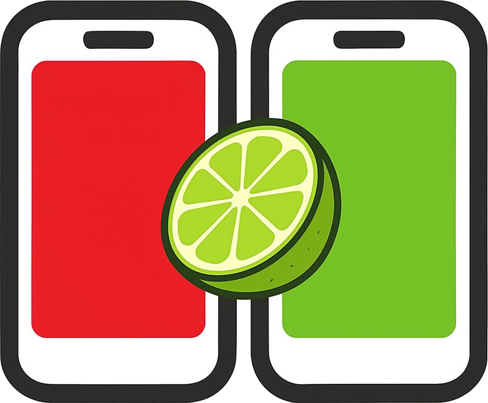
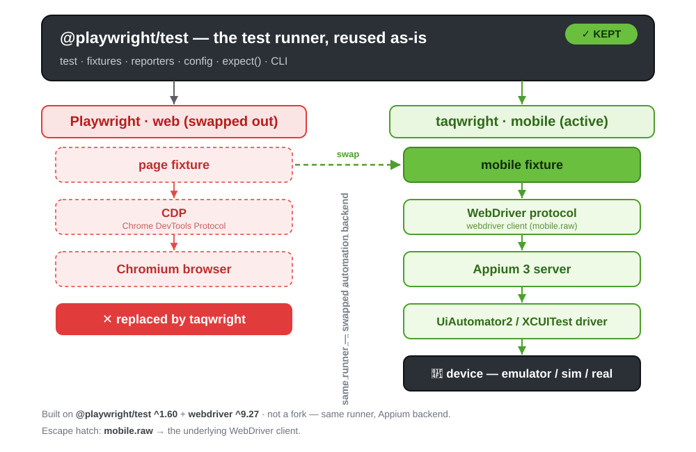

<!-- _class: lead -->
<!-- _header: "" -->
<!-- _paginate: false -->

# 📱 taqwright



### If you know Playwright, you already know mobile testing

**Open-source · Playwright test runner · Appium 3 underneath**

<span class="small">Syam Sasi · Taqelah</span>

<!--
0:00 — Intro. Who I am, one line. Quick poll: "Hands up if you've used Playwright for web? Appium?"
Today's path: install → init → run 3 ready-made tests → add-to-cart on Android AND iOS.
-->

---

<!-- _class: lead -->

## 📢 Disclaimer

<div class="big">

**This is not a product pitch.**

Today I'm sharing **only the open-source part** of taqwright —
**free to use, absolutely.**

</div>

<br>

<span class="small">No sign-up · no account · no paid tier needed for anything you see today.</span>

<!--
~0:30. Say it plainly and move on. Sets the tone: this is a community talk, not a sales talk.
-->

---

## Mobile test automation today 😩

Raw Appium / WebdriverIO is powerful — but:

- ⏳ **Explicit waits everywhere** → `waitForDisplayed({ timeout: 20000 })`
- 🧱 **Session boilerplate** → capabilities, server start, teardown
- 🎯 **Brittle selectors** → `UiSelector().className(…).instance(0)`
- 🐢 **Flaky runs** → hardcoded sleeps "fix" it until they don't

<br>

> Meanwhile on web, Playwright made all of this **go away**.
> **Why can't mobile feel like that?**

<!--
~1:00 → 3:00. Set up the pain. Ask: "Who has a sleep(2000) in their mobile suite right now?"
-->

---

## What taqwright is

> **The Playwright test runner + a flat `mobile` locator API, on top of Appium 3.**



<span class="small">**Not a fork.** `@playwright/test` is reused as-is — runner, fixtures, `expect`, HTML report, retries, workers, sharding, projects. Only the backend is swapped: `page` → **`mobile`** → WebDriver → Appium 3 → UiAutomator2 / XCUITest.</span>

<!--
3:00 → 4:30. The "aha" for engineers: Playwright's runner is untouched, only the bottom of the
stack changes. Everything the Playwright runner does, you get for free.
Android + iOS, TypeScript.
-->

---

<!-- _class: lead -->

# Part 1 · Install ⚙️

### From zero to a runnable project

<!--
4:30. Switch to terminal for the rest of this part if you're demoing live.
-->

---

## Install `@taqwright/taqwright`

```bash
nvm install 26 && nvm use 26              # ⚠️ Node 24+ required

npx @taqwright/taqwright init demo        # scaffold + install into ./demo
cd demo
```

<span class="small">Package: **`@taqwright/taqwright`** · command: **`taqwright`** — inside the project it's just `npx taqwright …`. Existing project? `npm i -D @taqwright/taqwright`</span>

<div class="cols">
<div>

**You need**
- **Node 24+** — the only hard fail
- Android: JDK · Android SDK · Appium 3
- iOS: macOS + **Xcode** (manual)

</div>
<div>

**Don't have the Android bits?**
`init` **probes your machine** and offers to install JDK + SDK + Appium (~700 MB) + an emulator (~1 GB).

</div>
</div>

<!--
4:30 → 5:30. Package name is @taqwright/taqwright; the CLI command it installs is `taqwright`.
So after install, inside the project: npx taqwright doctor / test / show-report.
Already have an SDK + AVD? init detects them and skips the toolchain install.
Why the scoped name: from an empty folder `npx taqwright init` fails — the unscoped `taqwright`
package is not on npm. `npx @taqwright/taqwright init demo` works anywhere and gives ONE folder,
ONE package.json (passing `demo` also skips the "Project location" prompt).
init runs its own `npm install`, so npm will print "6 high severity vulnerabilities" — one
upstream extract-zip issue via webdriver, no fix yet (full answer in the Q&A notes, last slide).
To hide it on stage: `export npm_config_audit=false npm_config_fund=false` in the demo terminal first.
-->

---

## `taqwright init` — the interactive flow

<div class="cols">
<div>

1. `Test folder name` *(tests)*
2. `Platform [android/ios/both]` → **android**
3. Android → **probes the toolchain** → auto-install if missing
4. `Also create an emulator?` *(or pick an existing AVD)*
5. **`Download the demo app?`** → **yes**
6. `Run npm install?` → yes

</div>
<div>

```text
Android toolchain:
  ✓ JDK            ✓ Android SDK (adb)
  ✓ Appium 3.x     ✓ uiautomator2 driver
  ✓ Android emulator (AVD)
  → detected a working Android
    toolchain — skipping install.

Created:
  package.json   taqwright.config.ts
  tsconfig.json  tests/example.spec.ts
  .npmrc         .gitignore
  app/DemoApp-v1.0.0.apk
```

</div>
</div>

<span class="small">Non-interactive / CI: `npx @taqwright/taqwright init demo --platform android --demo-app --yes`</span>

<!--
5:30 → 7:30. LIVE: answer the prompts. Say yes to the demo app — that's what gives us the
3 ready-made tests. Pick "android" for this part (the ready-made tests are Android-only).
If npm install is slow on venue wifi, cd into the pre-made folder you prepared last night.
CI line: without a TTY init skips the demo-app download unless --demo-app is passed — no
--demo-app means no 3 ready-made tests (you get a screen-size smoke test instead).
-->

---

## Before the first run — two health checks 🩺

```bash
npx taqwright doctor      # is my machine ready?  (13 checks)
npx taqwright devices     # what can I target?
```

```text
taqwright doctor (v1.0.0)
  [ok] Node.js 24+                 — v26.4.0
  [ok] adb (Android SDK)           — on PATH
  [ok] Appium (test server)        — v3.3.1
  [ok] Appium drivers              — uiautomator2, xcuitest
  …
```

<span class="small">Only **Node 24** is a hard fail — everything else is a warning, and you only need the rows for **your** platform. Appium **auto-starts** — no second terminal.</span>

<!--
7:30 → 8:00. Run doctor live — it's fast and reassuring. Skip devices if short on time.
-->

---

<!-- _class: lead -->

# Part 2 · Run the 3 ready-made tests ▶️

### What `init` gives you, out of the box

---

## `tests/example.spec.ts` — scaffolded for you

```ts
import { test, expect } from '@taqwright/taqwright';

test('user can log in to the demo app', async ({ mobile }) => {
  await mobile.getByXpath("//*[@hint='Username']").fill('emma@demoapp.com');
  await mobile.getByXpath("//*[@hint='Password']").fill('10203040');
  await mobile.getByUiSelector('new UiSelector().description("Login")').click();
  await expect(mobile.getByUiSelector('new UiSelector().description("View All")')).toBeVisible();
});

test('login fails with invalid username & password', async ({ mobile }) => { /* … */
  await expect(mobile.getByXpath("//*[contains(@content-desc, 'Invalid username or password.')]")).toBeVisible();
});

test('login is blocked without username & password', async ({ mobile }) => { /* … */
  await expect(mobile.getByUiSelector('new UiSelector().description("Please enter your username")')).toBeVisible();
});
```

<span class="small">One **happy path**, two **negative paths** — against the demo app `init` downloaded.</span>

<!--
8:00 → 9:00. Point out: test / expect / async ({ mobile }) — it's Playwright. The only new
word is `mobile`. No waits, no session setup, no teardown anywhere.
-->

---

## `taqwright.config.ts` — already wired up by `init`

<style scoped>
  pre { font-size: 0.8em; }
  .cols > div:first-child { flex: 1.3; }
  .cols > div:last-child { font-size: 0.8em; }
  .cols > div:last-child ul { margin: 0.2em 0 0.6em; }
</style>

<div class="cols">
<div>

```ts
projects: [{
  name: 'android',
  use: {
    platform: Platform.ANDROID,
    device: {
      provider: 'emulator',
      name: 'taqwright_api34',     // ← your AVD
    },
    appium: {
      autoStart: true,             // ← Appium on :4723
      autoStartDevice: true,       // ← boots that AVD
    },
    resetBetweenTests: true,       // ← fresh app each test
    buildPath: './app/DemoApp-v1.0.0.apk',
    appBundleId: 'com.taqelah.demo_app',
  },
}]
```

</div>
<div>

**📱 Emulator — auto-selected**
`init` lists the AVDs on your machine:
- **one** → used automatically
- **several** → you pick a number
- **none** → offers to create `taqwright_api34`

**📦 APK — auto-downloaded**
"Download the demo app? → yes" pulls `DemoApp-v1.0.0.apk` into `app/` and fills in `buildPath` + `appBundleId`.

<span class="small">Your own app? Swap those two lines.</span>

</div>
</div>

<!--
Open taqwright.config.ts in the editor for real — the audience trusts a live file more than a slide.
Point out: nothing here was typed by hand. The AVD name is whatever `init` found on THIS machine —
theirs will differ, and that's fine. Mention the commented-out BrowserStack / LambdaTest blocks
at the bottom of the file: cloud is a copy-paste away.
-->

---

## Run them

```bash
npx taqwright test --project android   # android only — runs all 3
npx taqwright show-report              # HTML report, same as Playwright
```

<div class="cols">
<div>

**What happens for you**
- 📱 emulator **booted** if it's off
- 🔌 Appium **auto-started** on `:4723`
- 📦 app **reinstalled + relaunched** before every test → clean state
- 🧹 session torn down after

</div>
<div>

**What you get back**
- ✅ `list` output in the terminal
- 📊 HTML report
- 🔎 **trace** on failure — timeline + a screenshot **after every action**

</div>
</div>

<!--
9:00 → 12:30. LIVE: npx taqwright test → 3 green → show-report.
Optional crowd-pleaser: change 'View All' to 'View Al' → rerun → open the trace and scrub
the timeline to the failing step. Then change it back.
The "reinstall before every test" is resetBetweenTests: true in the config init wrote.
-->

---

## 🎥 Video + 🔎 trace — same knobs as Playwright

<style scoped>
  table { font-size: 0.72em; }
</style>

<div class="cols">
<div>

```ts
projects: [{
  name: 'android',
  use: {
    // …platform, device, app…
    trace: 'on-failure',   // ← trace
    video: 'on-failure',   // ← video
    // network: 'on-failure',
  },
}]
```

<span class="small">**Values:** `'off'` · `'on'` · `'on-failure'` · `'retain-on-failure'`
`network` = HAR capture of app traffic</span>

</div>
<div>

| | Playwright | taqwright |
|---|---|---|
| Where | `use: { … }` | `use: { … }` — **same** |
| Trace | `.zip` → trace viewer | self-contained **`trace.html`** |
| Video | `.webm` | device **`screen.mp4`** |
| View | `show-report` | `show-report` — **same** |

**Trace:** clickable timeline · screenshot **after every action** · page-source XML

<span class="small">💡 CI: use **`'on-failure'`** — trace adds ~100–300 ms per action.</span>

</div>
</div>

<!--
~12:30 → 13:30. If you ran the "break a locator" trick on the previous slide, open the failing
test in the report now → taqwright-trace → scrub the timeline; taqwright-video plays the mp4.
Both land in test-results/ and are attached to the HTML report.
- Set per project in `use`, like Playwright. 'retain-on-failure' is an alias of 'on-failure' on mobile.
- Video: iOS-simulator support varies — Android emulator is the safe demo.
- network: HAR via a local proxy — skip unless asked.
-->

---

## Why no `sleep()` anywhere? Auto-waiting

<div class="cols">
<div>

❌ **One-shot, racy**
```ts
await mobile.waitForTimeout(2000);
if (await loc.isVisible()) {
  // checks ONCE, right now
}
```

</div>
<div>

✅ **Auto-retrying**
```ts
await expect(loc).toBeVisible();
// polls every 200 ms
// until visible or 30 s
```

</div>
</div>

- **Actions** (`click`, `fill`, `swipe`…) wait for **visible + enabled**
- **Assertions** retry until they pass or time out
- Hardcoded sleeps are the **#1 cause of flake** — and unnecessary here

<!--
13:30 → 14:30. "You just watched 3 tests pass with zero waits in the code. This is why."
Cut this slide first if running late.
-->

---

<!-- _class: lead -->

# Part 3 · Run in parallel ⚡

### More emulators, faster runs — one config change

<!--
14:30. Back in the demo/ folder.
-->

---

## How parallel runs work

<div class="cols">
<div>

**Default: serial** — `workers: 1`, one emulator, one test at a time.

**Parallel:** `workers: N` →
- **N tests at once**
- each worker gets **its own emulator**
- …and **its own Appium**: worker 0 → `:4723`, worker 1 → `:4724` (automatic)

</div>
<div>

**Two rules**
1. `workers` **≤ number of devices**
   (too few → fails fast at start-up)
2. `fullyParallel: true` → tests **inside one file** spread across workers too

<span class="small">Our 3 ready-made tests live in **one file** — without `fullyParallel` they'd all go to one worker.</span>

</div>
</div>

<!--
14:30 → 15:30. Same model as Playwright's workers — the difference is each worker needs a DEVICE.
-->

---

## Add a parallel project — existing one untouched ✏️

<style scoped>
  pre { font-size: 0.78em; }
  .cols > div:first-child { flex: 1.5; }
  .cols > div:last-child { font-size: 0.8em; }
</style>

<div class="cols">
<div>

```ts
export default defineConfig({
  fullyParallel: true,                     // ← 1
  projects: [
    { name: 'android', /* … unchanged … */ },
    {
      name: 'android-parallel',            // ← new project
      workers: 2,                          // ← 2
      use: {
        platform: Platform.ANDROID,
        device: {
          provider: 'emulator',
          pool: [                          // ← 3
            { name: 'taqwright_api34', udid: 'emulator-5554' },
            { name: 'Pixel_7_API_34',  udid: 'emulator-5556' },
          ],
        },
        appium: { autoStart: true, autoStartDevice: true },
        // buildPath / appBundleId / resetBetweenTests — as android
      },
      testMatch: ['**/android/**'],
    },
  ],
});
```

</div>
<div>

**New project** — keep `android` for serial runs, pick parallel with `--project`

**① `fullyParallel`** — split tests within a file (top-level only)

**② `workers: 2`** — 2 tests at once

**③ `pool`** — one emulator per worker: AVD **name** (to boot it) + **udid** (its serial)
→ from `npx taqwright devices`

**No names to copy?** → let taqwright find the emulators (next slide)

</div>
</div>

<!--
15:30 → 17:00. Open demo/taqwright.config.ts — android-parallel is already there.
Walk the ← markers. Point out: the original `android` project is untouched — same tests, you
choose serial vs parallel with --project.
- fullyParallel must be top-level (taqwright rejects it per project). Projects with 1 worker
  still run one test at a time, so it doesn't change the others.
- pool needs TWO DIFFERENT AVDs — the same AVD can't be listed twice. Names/serials come from
  `npx taqwright devices`; Pixel_7_API_34 gets emulator-5556 if it's the 2nd emulator booted.
- autoStartDevice cold-boots each pool entry by its AVD name.
- autoDiscover: no names at all; boot 2 emulators first. Portable across machines.
- Lab 06 in the tutorial repo has all four variants (single · pool · auto-1 · auto-2).
-->


---

## Or let taqwright find the emulators 🔍

<style scoped>
  .cols > div:last-child { font-size: 0.85em; }
</style>

<div class="cols">
<div>

```ts
{
  name: 'android-auto',
  workers: 2,
  use: {
    platform: Platform.ANDROID,
    device: {
      provider: 'emulator',
      autoDiscover: true,     // ← that's it
    },
    appium: { autoStart: true },
    // app settings — same as android
  },
  testMatch: ['**/android/**'],
}
```

</div>
<div>

**`pool`** — you list each emulator
✅ exact devices, boots them for you
❌ AVD names + serials are **machine-specific**

**`autoDiscover`** — taqwright finds them
✅ **no names** — same config on every laptop & CI
✅ each worker gets its own emulator
⚠️ **boot the emulators first** — 2 workers → 2 running

</div>
</div>

<!--
~17:00 → 18:00. Third project in the same config — `android` and `android-parallel` untouched.
Pick one per run with --project. This is the one to recommend: nothing machine-specific to edit,
so a teammate or CI runner can use the config as-is.
If only one emulator is running, a 2-worker run can't fan out — boot the second
(`emulator -avd Pixel_7_API_34`) or drop to workers: 1.
-->
---

## Run it ⚡

```bash
npx taqwright devices                            # need 2 AVDs
npx taqwright test --project android-parallel    # pool: 3 tests, 2 emulators, at once
npx taqwright test --project android-auto        # autoDiscover: same, no names
npx taqwright test --project android             # same tests, serial — compare the time
npx taqwright show-report
```

<div class="cols">
<div>

**What you'll see**
- 📱📱 **two emulators** driven at once
- 🔌 Appium on **:4723** and **:4724**
- ⏱️ wall-clock time drops — 3 tests finish in ~2 test-lengths

</div>
<div>

**Scale further**
- more emulators → bump `workers` + add to `pool`
- cloud: `workers: N` on LambdaTest / BrowserStack — **no `pool`**, the grid supplies devices

</div>
</div>

<!--
18:00 → 18:30. LIVE if both emulators are already booted — booting two cold AVDs on stage is slow.
If the run fails with "workers must be <= device count": only one device is available — boot
the second AVD or drop to workers: 1.
-->

---

<!-- _class: lead -->

# Part 4 · Record with codegen 🎥

### Don't hand-write locators — record them

<!--
18:30. Still in the demo/ folder from Part 1.
-->

---

## Codegen — Playwright-style recording for mobile

```bash
npx taqwright codegen        # opens the inspector at localhost:4280
```

<div class="cols">
<div>

**One screen, four panels**
- 📱 **live screen mirror** — tap / type / swipe the real device in your browser
- 🌳 **view tree** — the live accessibility tree
- 🎯 **locators** — every candidate, **ranked + uniqueness-checked**
- 📝 **recorded script** — taqwright code, written as you act

</div>
<div>

**Smart locators**
- prefers **stable ids** over positions
- checks each one is **unique** on screen
- ⚠️ flags **fragile** (positional / xpath) picks
- click **assert** → a retrying `expect()`

</div>
</div>

<span class="small">Reads `taqwright.config.ts` — same device, same app, Appium auto-starts. Works on cloud devices too.</span>

<!--
18:30 → 19:30. Frame it: "Playwright codegen, but for a phone."
-->

---

## 🎬 Live — record the add-to-cart flow

```bash
npx taqwright codegen
```

1. Log in — `emma@demoapp.com` / `10203040`
2. **View All** → open **Black Sequin Mini**
3. **Add to Cart** → **VIEW CART**
4. Select **Proceed to Checkout** → **assert visible**
5. Copy the **Recorded script** → `tests/add-to-cart.spec.ts`

```bash
npx taqwright test tests/add-to-cart.spec.ts --project android
```

<!--
19:30 → 23:00. LIVE, in demo/:
- Browser opens at localhost:4280. Connect to the emulator from the config.
- While recording, click one element and show the Locators tab: ranked list, "unique" check.
- Step 4: use the assert button, not a tap — that is what produces the expect().
- Paste into tests/add-to-cart.spec.ts, run it → green.
IF CODEGEN MISBEHAVES: skip to the next slide (the recorded script) and talk it through.
-->

---

## What codegen wrote ✍️

```ts
test("recorded test", async ({ mobile }) => {
  await mobile.getByXpath("//*[@hint='Username']").fill("emma@demoapp.com");
  await mobile.getByXpath("//*[@hint='Password']").fill("10203040");
  await mobile.getByUiSelector("new UiSelector().description(\"Login\")").click();
  await mobile.getByUiSelector("new UiSelector().description(\"View All\")").click();
  await mobile.getByUiSelector("new UiSelector().descriptionContains(\"Black Sequin Mini\")").click();
  await mobile.getByUiSelector("new UiSelector().description(\"Add to Cart\")").click();
  await mobile.getByUiSelector("new UiSelector().description(\"VIEW CART\")").click();
  await expect(mobile.getByUiSelector("new UiSelector().description(\"Proceed to Checkout\")")).toBeVisible();
});
```

<span class="small">✅ Runs green on Android · ❌ every locator is **Android-only**. **Next:** the same flow on iOS.</span>

<!--
23:00 → 24:00. This is the real recording from rehearsal — same locators lab 11's Android page
objects use. Your live recording may differ slightly (e.g. a different but equivalent locator); fine.
Lab 11 adds a search step ("black") before opening the product — that's why its page object is
called searchAndAddToCart. Mention it if anyone compares the two.
Segue: "This works. Now let's record the SAME flow on iOS."
-->

---

## Same flow — recorded on iOS 🍎

```ts
import { test, expect } from '@taqwright/taqwright';

test("recorded test", async ({ mobile }) => {
  await mobile.getById("Username").fill("emma@demoapp.com");
  await mobile.getById("Password").fill("10203040");
  await mobile.getById("Login").click();
  await mobile.getById("View All").click();
  await mobile.getById("Black Sequin Mini\n$119.99").click();
  await mobile.getById("Add to Cart").click();
  await mobile.getById("VIEW CART").click();
  await expect(mobile.getById("Proceed to Checkout")).toBeVisible();
});
```

<span class="small">Same 8 steps · iOS exposes **accessibility ids** → every locator is a clean `getById` · but **not one** matches the Android script.</span>

<!--
~23:30. Same `npx taqwright codegen`, pointed at the iOS simulator (ios project). Show it
pre-recorded — don't record iOS live, there isn't time.
Point at "Black Sequin Mini\n$119.99": the product's id includes its PRICE. Works today, breaks the
day the price changes. Codegen shows you what the app exposes; the fix is an accessibility id in
the app. Good line: "codegen is a starting point, not the finished test."
-->

---

## Run it on iOS — two changes to the config 🍎

<style scoped>
  pre { font-size: 0.8em; }
  .cols > div:first-child { flex: 1.35; }
  .cols > div:last-child { font-size: 0.8em; }
</style>

<div class="cols">
<div>

```ts
{
  name: 'ios',
  use: {
    platform: Platform.IOS,
    device: {
      provider: 'emulator',
      name: 'iPhone 17',                   // ← 1
      osVersion: '26.5',                   // ← 1
      udid: '30FA4507-…-A40DA229CC13',     // ← 1
    },
    resetBetweenTests: true,               // ← 2
    buildPath: './app/DemoApp-v1.0.0.app', // ← 2
    appBundleId: 'com.taqelah.demoApp',    // ← 2
  },
  testMatch: ['**/ios/**'],
}
```

</div>
<div>

**① Pick the simulator**
`init` wrote `name: /iPhone/`. Pin yours from:
```bash
npx taqwright devices
```
→ copy **name · osVersion · udid**

**② Point at the iOS app**
`init` only downloads the Android APK → add the simulator build (`.app`) + its bundle id.

**Run only the new test**
```bash
npx taqwright test --project ios \
  -g "Add to Cart"
```

</div>
</div>

<!--
~24:00. Open taqwright.config.ts live and point at the ios block.
The udid is THIS Mac's simulator — theirs will differ; always take it from `npx taqwright devices`.
Boot the simulator before the talk: the ios project has no autoStartDevice.
Note the iOS bundle id differs from Android's: com.taqelah.demoApp vs com.taqelah.demo_app.
testMatch keeps each project on its own folder: tests/android/** vs tests/ios/**.
-g / --grep filters by test title (regex), same as Playwright — runs just "Add to Cart", skipping the
screen-size smoke test in the same file. All iOS tests: drop the -g.
If you see "Appium server is already running on this port": a leftover Appium (e.g. from codegen) is
holding :4723 — stop it (Ctrl+C in that terminal, or `pkill -f appium`) and rerun.
-->

---

## Same tests, real devices — LambdaTest ☁️

<style scoped>
  pre { font-size: 0.7em; }
  .cols > div:first-child { flex: 1.45; }
  .cols > div:last-child { font-size: 0.78em; }
</style>

<div class="cols">
<div>

```ts
{
  name: 'lambdatest-android',
  use: {
    platform: Platform.ANDROID,
    device: { provider: 'lambdatest', name: 'Pixel 8', osVersion: '14' },
    buildPath: 'lt://APP101602071790272933857933',    // uploaded APK
    appBundleId: 'com.taqelah.demo_app',
  },
  testMatch: ['**/android/**'],
},
{
  name: 'lambdatest-ios',
  use: {
    platform: Platform.IOS,
    device: { provider: 'lambdatest', name: 'iPhone 15', osVersion: '17' },
    buildPath: 'lt://APP10160372241789400782563395',  // uploaded iOS build
    appBundleId: 'com.taqelah.demoApp',
  },
  testMatch: ['**/ios/**'],
},
```

</div>
<div>

**Credentials — env, not config**
```bash
export LAMBDATEST_USERNAME=…
export LAMBDATEST_ACCESS_KEY=…
```

**Run**
```bash
npx taqwright test \
  --project lambdatest-android
npx taqwright test \
  --project lambdatest-ios
```

- **Same test files** — only the project config changes
- No local Appium / emulator
- 🎥 video + device logs on the LambdaTest dashboard

</div>
</div>

<!--
~24:30 → 26:30. Add these two blocks to the projects array (init's config already has a commented
LambdaTest example at the bottom — uncomment + edit).
- device name + osVersion are REQUIRED for cloud; pick from the LambdaTest real-device list.
- buildPath: these lt://APP… ids are MY uploads — an app id only works for the LambdaTest account
  that uploaded it. Attendees: upload your own build and use its id, or set buildPath to a local
  file (e.g. './app/DemoApp-v1.0.0.apk') and taqwright uploads it for you on every run.
- iOS on REAL devices needs a device build (.ipa). A simulator .app won't install — upload a
  device build and use its lt:// id.
- Run a single test on the cloud the same way: add -g "Add to Cart".
- Creds in env only — never commit them. BrowserStack works the same: provider: 'browserstack'.
-->

---

## Codegen records gestures too 👆

<style scoped>
  table { font-size: 0.72em; }
</style>

**Select an element → Actions tab → pick the gesture.** Screen-wide swipes & scrolls come from the screen controls.

| Gesture | What codegen writes |
|---|---|
| ⬅️➡️ **Swipe left / right** | `await mobile.swipe('left')` · element: `await locator.swipeLeft()` / `.swipeRight()` |
| ⬆️⬇️ **Scroll up / down** | `await mobile.scroll('down')` · to an element: `await locator.scrollIntoView()` |
| ✋ **Drag & drop** | `await source.dragTo(target)` |
| 👇 **Long press** | `await locator.longPress()` |
| 👆👆 **Double tap** | `await locator.doubleTap()` |
| 🔍 **Zoom in / out** | `await locator.pinchOut()` → zoom **in** · `await locator.pinchIn()` → zoom **out** |

<span class="small">Same auto-waiting as `click` — every element gesture waits for **visible + enabled** first. Works on Android **and** iOS.</span>

<!--
~26:30 → 28:00. If time allows, demo 1–2 gestures live in codegen (e.g. scroll down the catalogue,
long-press / double-tap a product) and show the line appear in the Recorded script.
Screen-level swipe/scroll may be recorded with start/end points added:
  await mobile.scroll('down', { from: {…}, to: {…} }) — same call, just more precise.
Zoom naming trips people up: pinchOut = fingers spread apart = zoom IN; pinchIn = zoom OUT.
Also available: element swipeUp() / swipeDown(), and mobile.swipe('up' | 'down').
-->

---

## Try it tonight 🚀

```bash
npx @taqwright/taqwright init demo               # your project + 3 ready-made tests
cd demo && npx taqwright test

git clone https://github.com/taqelah/taqwright-tutorial   # or: the full tutorial
cd taqwright-tutorial/tutorial_11_page_object_lab && npm install
npm run test:android
```

- 🧪 **12 hands-on labs:** codegen · config · parallel · sharding · retries · traces · page objects · cloud
- 📦 Demo app **committed in the repo** — nothing to download

<br>

⭐ **Star it** · 🐛 **issues, ideas, PRs welcome** → **github.com/taqelah/taqwright**

<!--
~28:00. Leave this slide up during Q&A — ~2 min left for Q&A and live-demo buffer.
-->

---

<!-- _class: lead -->
<!-- _paginate: false -->

# 🙌 Thank you! Questions?

**github.com/taqelah/taqwright**

🔗 [linkedin.com/in/syam-sasi](https://www.linkedin.com/in/syam-sasi/) · 🌐 [taqelah.sg](https://taqelah.sg/)

<!--
~28:30 → 30:00 Q&A.
Likely questions:
- "Is it a Playwright fork?" → No; reuses @playwright/test, swaps backend.
- "Flutter / React Native?" → Yes, it's native Appium underneath — the demo app is Flutter.
- "Why are the 3 ready-made tests Android-only?" → the demo app init downloads is an APK;
  the iOS flow lives in the tutorial repo (lab 11).
- "Parallel?" → workers + device pool / autoDiscover; each worker gets its own Appium.
- "Cloud?" → device.provider: 'browserstack' | 'lambdatest' — same spec.
- "Existing Appium suite?" → mobile.raw escape hatch; migrate spec by spec.
- "npm says 6 high severity vulnerabilities?" → It is ONE upstream issue (extract-zip, symlink path
  traversal), counted once per package in the chain: taqwright → webdriver → @wdio/config · @wdio/utils
  → @puppeteer/browsers → extract-zip. Not in taqwright code; any WebdriverIO 8.15+ project shows it.
  No upstream fix yet — updating webdriver picks it up once one ships. Do NOT run `npm audit fix --force`.
- "How do I get locators?" → npx taqwright codegen — records a flow, ranks locators.
-->
